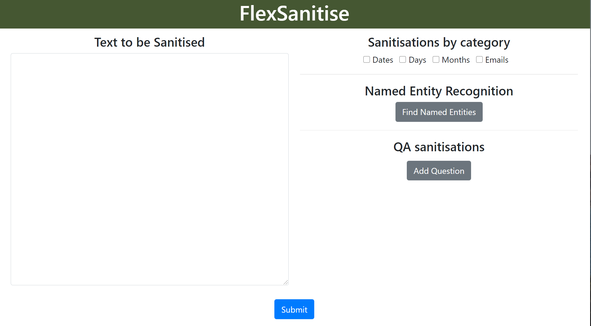
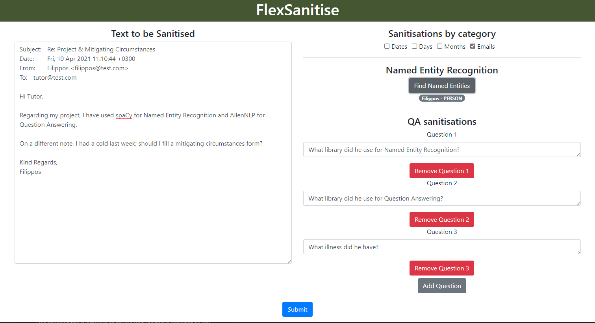
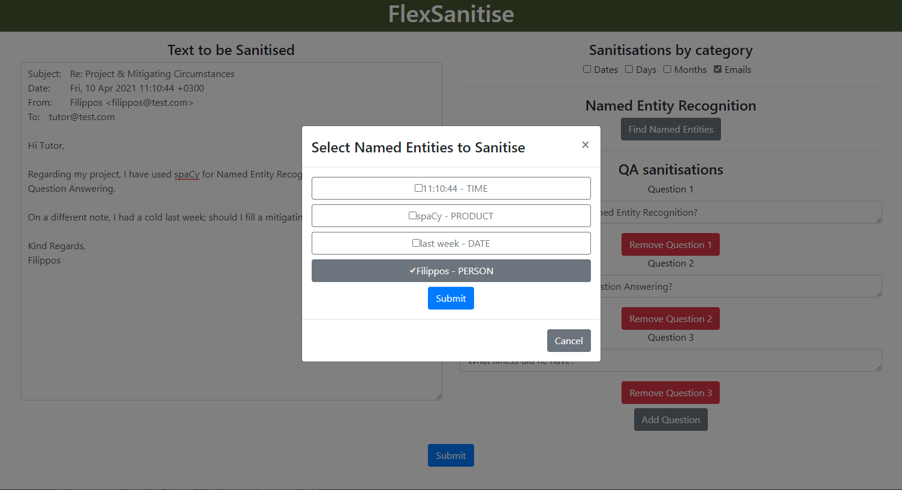
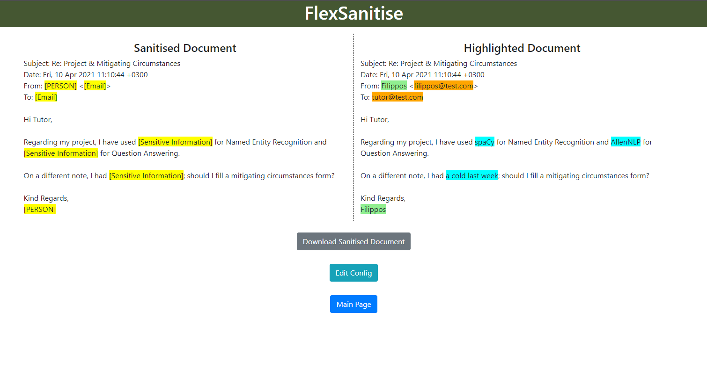

# FlexSanitise Front-End

This is the front-end of [FlexSanitise](https://github.com/FilipposVlahos/https://github.com/FilipposVlahos/FlexSanitise) API developed as part of my 3rd year project for my BSc in Computer Science at the University of Manchester.

## Install dependencies

### `npm install`

## Run application

In the project directory, you can run:

### `npm start`

Runs the app in the development mode.\
Open [http://localhost:3000](http://localhost:3000) to view it in the browser.

## Other available scripts

Other available scripts are documented [here](https://create-react-app.dev/docs/available-scripts/)

## Screenshots
* **Main page**

* **Main page with input**

* **NER modal**

* **Output**

